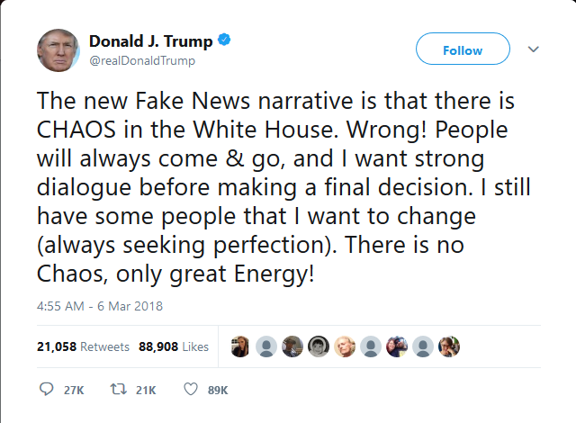

# Abstract

Twitter, and social media as a whole, has transformed the way that individuals in our society can interact with one another. The relative anonymity and ability to instantly respond has made some parts of the internet, like Twitter, develop troubling atmospheres, and recently some concern has been raised over whether Twitter, and the social internet, are actually beneficial. With the current political climate in the United States, it can be easy to feel divided. And with tweets like this:

it is easy to see Twitter as the problem. But is that the case? Is America divided by Twitter, or unified by it? Do we care about politics, or are other things more important? Using the TwitteR library, we try to answer this question by comparing the trending hashtags in all 50 states. We also look at what the most popular tweets are in general.

We are using the TwitteR library for R provided by CRANR, in conjunction with the dedicated [Twitter search API](https://developer.twitter.com/en/docs/tweets/search/api-reference/get-search-tweets) provided by Twitter itself. The data we can retrieve is limited to tweets from the past seven days, and there is a limit on the number of requests that can be made in a 10 minute period. With these limitations in mind, we have constructed tools to help you investigate questions about Twitter and what trends exist on it.

## Findings
This is by no means an exhaustive list of interesting things we have seen in our data, but instead are a good base to work from in further investigation.
- Americans tweet about a wide variety of topics, most of them shared by all States
- Twitter trends follow major events, and trends move quickly between popular topics
- Individual States have character and uniqueness, but in general national trends track locally

This is far from conclusive research, but based purely on tweets, it seems that Americans are far more similar than we are different. Maybe not a surprising result, but an interesting and comforting one nonetheless. We have provided the tools that we use to you, for you to investigate and come to your own conclusions.
